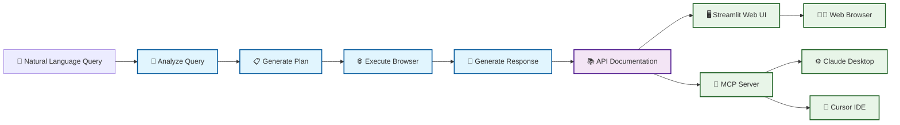

# EasyDocs - AI-Powered API Documentation Agent

Transform natural language queries into production-ready API documentation with our intelligent LangGraph-based agent.

## ✨ Features

- **🧠 Intelligent Query Analysis**: Automatically identifies API platforms (OpenAI, Stripe, Bright Data, etc.) and operation types
- **🔍 Smart Documentation Extraction**: Uses advanced browser automation to scrape official API documentation
- **📝 Production-Ready Output**: Generates clean documentation with cURL examples, authentication, error handling, and parameters
- **🎯 Two Deployment Options**:
  - **Web UI**: Beautiful Streamlit interface with real-time progress tracking
  - **MCP Server**: Direct integration with Cursor, Claude Desktop, and any MCP-compatible client
- **⚡ Real-Time Processing**: Watch each step execute live from query analysis to final documentation


## Demo

[](https://www.youtube.com/watch?v=tfn8sSoPYl4)

*Click to watch the full demo on YouTube*

## 🏗️ Architecture

Built with LangGraph for robust, scalable AI workflows:



## 📁 Project Structure

```
EasyDocs/
├── src/
│   ├── graph.py          # LangGraph workflow definition
│   ├── nodes.py          # Individual processing nodes
│   └── state.py          # State management schema
├── app.py                # Streamlit web interface
├── main.py               # Testing and validation suite
├── mcp_wraper.py         # MCP server wrapper
├── test_single.py        # Individual node testing
├── .env.example          # Environment variables template
└── README.md             # This file
```

## 🚀 Quick Start

### Prerequisites

- Python 3.8+
- API keys for target platforms (OpenAI, Bright Data, etc.)

### Installation

1. **Clone the repository**
   ```bash
   git clone https://github.com/MeirKaD/EasyDocs.git
   cd EasyDocs
   ```

2. **Create virtual environment**
   ```bash
   python -m venv venv
   source venv/bin/activate  # On Windows: venv\Scripts\activate
   ```

3. **Install dependencies**
   ```bash
   pip install -r requirements.txt
   ```

4. **Configure environment**
   ```bash
   cp .env.example .env
   # Edit .env with your API keys
   ```

### Environment Variables

Create a `.env` file with the following variables:

```env
# Google AI (for LLM processing)
GOOGLE_API_KEY=your_google_ai_api_key

# Bright Data (for web scraping)
BRIGHT_DATA_API_TOKEN=your_bright_data_token
WEB_UNLOCKER_ZONE=unblocker
BROWSER_ZONE=scraping_browser
```

## 💻 Usage

### Option 1: Web Interface

Launch the Streamlit app for an interactive web experience:

```bash
streamlit run app.py
```

**Features:**
- 📝 Clean input interface with example queries
- 🔄 Real-time progress tracking
- 📊 Confidence indicators and debug information
- 📥 Download generated documentation
- 🎨 Professional UI with responsive design

**Example Queries:**
- "How to create a payment intent with Stripe API"
- "How to send a POST request to OpenAI's chat completion API"
- "How to authenticate with Bright Data's Web Scraper API"

### Option 2: MCP Server Integration

Transform your coding workflow by integrating directly with your development environment.

#### Setup with Claude Desktop

1. **Add to Claude Desktop configuration** (`claude_desktop_config.json`):
   ```json
   {
     "mcpServers": {
       "EasyDocs": {
         "command": "/path/to/your/EasyDocs/venv/bin/python",
         "args": ["/path/to/your/EasyDocs/mcp_wraper.py"]
       }
     }
   }
   ```

2. **Update paths** to match your installation directory

3. **Restart Claude Desktop**

4. **Use in conversations**:
   ```
   @EasyDocs generate API documentation for creating a Stripe payment intent
   ```

#### Setup with Cursor

1. **Install MCP extension** in Cursor
2. **Add server configuration** pointing to `mcp_wraper.py`
3. **Use directly in your code editor** for instant API documentation

#### Test MCP Server

Verify your MCP server is working:

```bash
# Test with MCP Inspector
npx @modelcontextprotocol/inspector mcp_wraper.py

# Or test directly
python mcp_wraper.py
```

## 🧪 Testing

### Run Full Test Suite

```bash
python main.py
```

This will:
- ✅ Validate graph compilation
- 🔍 Test query analysis accuracy
- ⚡ Verify step-by-step execution
- 📋 Check final documentation quality

### Test Individual Components

```bash
# Test specific nodes
python test_single.py

# Test with custom query
python -c "
from src.graph import create_demo_graph
graph = create_demo_graph()
result = graph.invoke({
    'query': 'Your test query here',
    'platform': '', 'action_plan': [], 'extracted_content': '',
    'final_response': '', 'error': None, 'operation_type': '',
    'confidence': 0.0, 'estimated_duration': 0, 'complexity_level': '',
    'current_step': 0, 'confidence_level': None, 'explanation': None
})
print(result['final_response'])
"
```

## 📖 API Reference

### Core Functions

#### `analyze_query(state: DemoState) -> DemoState`
Analyzes user queries to extract platform and operation type.

**Input**: Query string in natural language
**Output**: Platform identification, operation type, confidence score

#### `generate_plan(state: DemoState) -> DemoState`
Creates step-by-step action plan for documentation extraction.

**Output**: Action steps, estimated duration, complexity level

#### `execute_browser(state: DemoState) -> DemoState`
Executes browser automation to extract API documentation.

**Output**: Extracted content, confidence level, processing explanation

#### `generate_response(state: DemoState) -> DemoState`
Generates developer-friendly documentation with examples.

**Output**: Formatted documentation with cURL commands, authentication, parameters

### MCP Tool

#### `generate_api_docs(question: str) -> str`
Main MCP tool for generating API documentation.

**Parameters:**
- `question` (string): Natural language query about API documentation needs

**Returns:** Formatted API documentation with examples and best practices


## Tech Stack
- **Langgraph**
- **MCPuse**
- **Gemini**
- **FastMCP**
- **Streamlit**


## 🐛 Troubleshooting

### Common Issues

**"Module not found" with MCP server:**
```bash
# Ensure virtual environment path is correct
which python  # Use this path in Claude Desktop config
```

**Browser execution fails:**
```bash
# Check Bright Data credentials
echo $BRIGHT_DATA_API_TOKEN
```

**Low confidence documentation:**
- Try more specific queries
- Include platform name explicitly
- Check if platform is supported

### Debug Mode

Enable detailed logging:

```python
# In src/nodes.py, add:
import logging
logging.basicConfig(level=logging.DEBUG)
```

## 🤝 Contributing

We welcome contributions! Here's how to get started:

1. **Fork the repository**
2. **Create feature branch**: `git checkout -b feature/amazing-feature`
3. **Add tests** for new functionality
4. **Run test suite**: `python main.py`
5. **Submit pull request**

## 📄 License

This project is licensed under the MIT License - see the [LICENSE](LICENSE) file for details.

## 🙋‍♂️ Support

- **Documentation**: Check this README and inline code comments
- **Issues**: Open a GitHub issue for bugs or feature requests
- **Discussions**: Use GitHub Discussions for questions and ideas

---

**Ready to transform your API development workflow?** Start with the web interface, then integrate the MCP server for seamless coding productivity!

*Built with ❤️ for the developer community*
